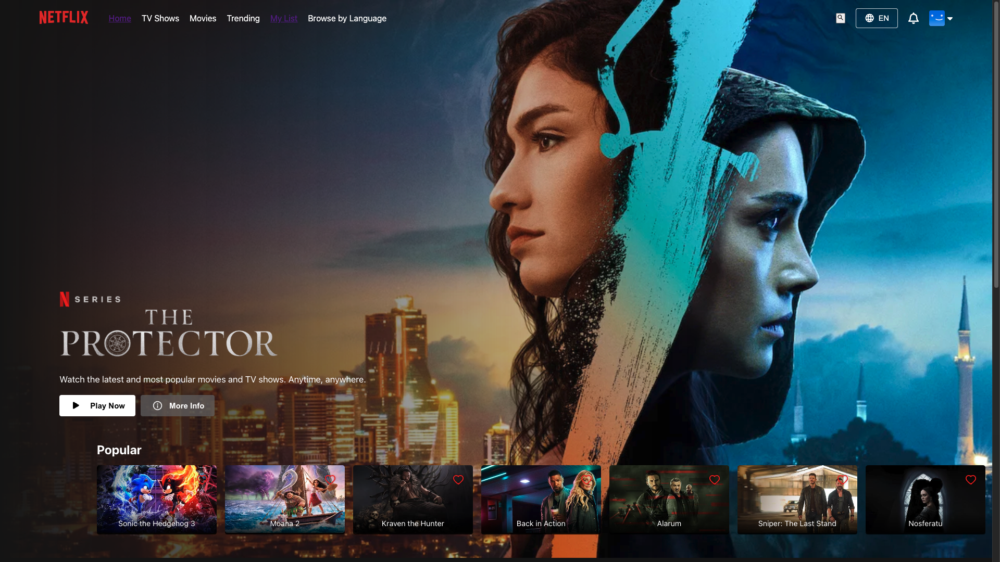
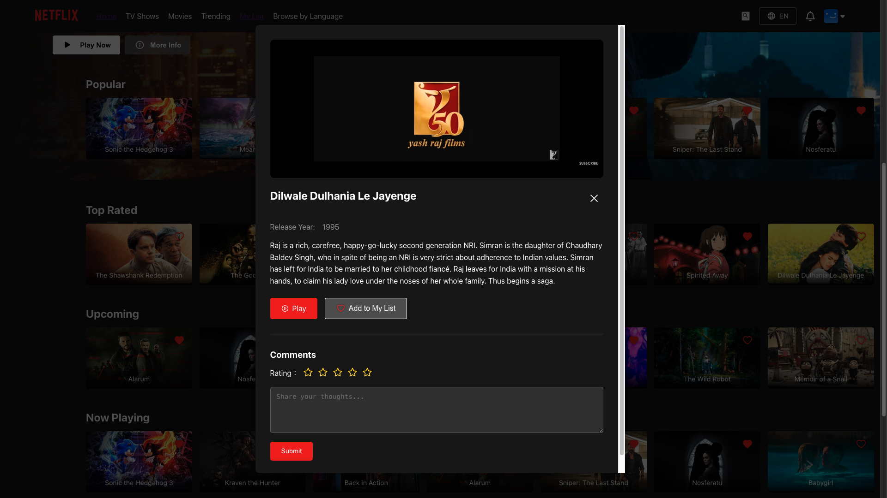

# Netflix Clone

A full-stack Netflix clone built with the MERN stack (MongoDB, Express.js, React.js, Node.js), featuring user authentication, movie browsing, favorites management, and a comment system.

🌐 [Live Demo](https://client-umber-one.vercel.app/) | [API Documentation](https://github.com/HsuanChi1204/Netflix-clone#-api-endpoints) | [Backend Repository](https://github.com/HsuanChi1204/Netflix-clone)

## 📸 Screenshots

### Home Page


### Movie Details


### Favorites List


### Comments Function


## 🚀 Features

- **User Authentication**
  - JWT-based authentication
  - Secure password hashing
  - Protected routes
  - Session management

- **Movie Experience**
  - Browse movies by categories
  - Watch movie trailers
  - Search functionality
  - Responsive video player
  - Multi-language support (English/Traditional Chinese)

- **Interactive Features**
  - Add/remove favorites
  - Comment system with ratings
  - Personal watchlist
  - Dynamic UI updates
  - Real-time language switching

- **Modern UI/UX**
  - Netflix-like interface
  - Responsive design
  - Smooth animations
  - Loading states
  - Error handling with toast notifications

## 🛠 Technology Stack

### Frontend
- **React.js** - UI library
- **Vite** - Build tool
- **React Router** - Navigation
- **Axios** - HTTP client
- **React Icons** - Icon components
- **React Toastify** - Toast notifications
- **i18next** - Internationalization

### Backend
- **Node.js** - Runtime environment
- **Express.js** - Web framework
- **MongoDB** - Database
- **Mongoose** - ODM
- **JWT** - Authentication
- **Bcrypt** - Password hashing

### DevOps & Testing
- **Docker** - Containerization
- **Jest** - Testing
- **GitHub Actions** - CI/CD
- **ESLint** - Code linting
- **Vercel** - Frontend deployment
- **Railway** - Backend deployment

## 🚦 Getting Started

### Prerequisites
- Node.js (v14 or higher)
- MongoDB Atlas account
- npm or yarn
- Git

### Installation

1. Clone the repository
```bash
git clone https://github.com/HsuanChi1204/Netflix-clone.git
cd Netflix-clone
```

2. Install dependencies
```bash
# Install frontend dependencies
cd client
npm install

# Install backend dependencies
cd ../server
npm install
```

3. Environment Setup

Create `.env` files in both client and server directories:

```bash
# server/.env
PORT=5001
MONGODB_URI=your_mongodb_uri
JWT_SECRET=your_jwt_secret

# client/.env
VITE_API_URL=http://localhost:5001
VITE_TMDB_API_KEY=your_tmdb_api_key
```

4. Start Development Servers

```bash
# Start backend server
cd server
npm run dev

# Start frontend in a new terminal
cd client
npm run dev
```

## 📁 Project Structure
```
Netflix-clone/
├── client/                # Frontend React application
│   ├── src/
│   │   ├── components/    # Reusable components
│   │   ├── contexts/      # Context providers
│   │   ├── pages/         # Page components
│   │   ├── locales/       # Translation files
│   │   ├── assets/        # Static assets
│   │   └── App.jsx        # Main application
│   └── package.json
│
├── server/                # Backend Node.js application
│   ├── src/
│   │   ├── config/       # Configuration files
│   │   ├── controllers/  # Request handlers
│   │   ├── models/       # Database models
│   │   ├── routes/       # API routes
│   │   ├── middlewares/  # Custom middlewares
│   │   └── index.js      # Entry point
│   └── package.json
│
└── README.md
```

## 🔑 API Endpoints

### Authentication
- `POST /api/auth/register` - Register new user
- `POST /api/auth/login` - User login
- `GET /api/auth/me` - Get current user info

### Favorites
- `GET /api/favorites` - Get user's favorites
- `POST /api/favorites` - Add to favorites
- `DELETE /api/favorites/:id` - Remove from favorites
- `GET /api/favorites/check/:id` - Check if movie is favorited

### Comments
- `GET /api/comments/:movieId` - Get movie comments
- `POST /api/comments` - Add comment
- `PUT /api/comments/:id` - Update comment
- `DELETE /api/comments/:id` - Delete comment

## 🔒 Environment Variables

### Backend
```env
PORT=5001
MONGODB_URI=your_mongodb_uri
JWT_SECRET=your_jwt_secret
```

### Frontend
```env
VITE_API_URL=http://localhost:5001
VITE_TMDB_API_KEY=your_tmdb_api_key
```

## 🛡 Security Features
- JWT authentication
- Password hashing with bcrypt
- Protected API routes
- Input validation
- XSS protection
- CORS configuration
- Rate limiting

## 🚧 Future Improvements
- [ ] Add social authentication (Google, Facebook)
- [ ] Implement infinite scrolling for movie lists
- [ ] Add user profiles with avatars
- [ ] Enhance search with filters and sorting
- [ ] Add movie recommendations
- [ ] Implement watch history
- [ ] Add email verification
- [ ] Implement password reset

## 👥 Contributing
Contributions are welcome! Please feel free to submit a Pull Request.

## 📝 License
This project is licensed under the MIT License - see the [LICENSE](LICENSE) file for details.

## 🙏 Acknowledgments
- [TMDB API](https://www.themoviedb.org/documentation/api) for movie data
- [Netflix](https://www.netflix.com) for design inspiration
- [Vercel](https://vercel.com) for frontend hosting
- [Railway](https://railway.app) for backend hosting

---
Created by [HsuanChi1204](https://github.com/HsuanChi1204)
